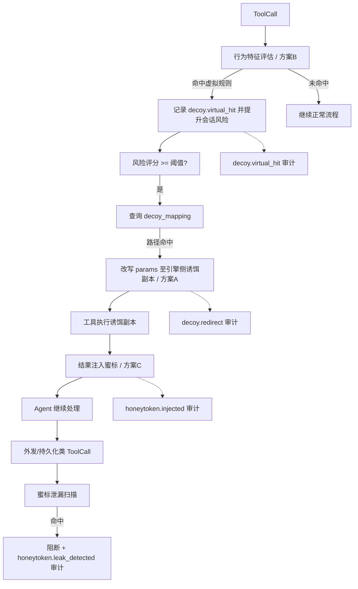

# GovAgent-Shield 诱饵防御 ABC 组合方案

> 状态：设计已落地实现
> 已实现：方案 B（行为观察）、方案 A（Shadow Decoy 路由）、
> 方案 C 第一阶段（外发参数令牌泄漏检测）
> 待实现：方案 C 结果注入（依赖 ExecutionProxy / 结果中间件）
> 目标：在不污染用户 workspace 的前提下，提高诱饵可达性，并建立
> "行为预判 → 运行时重定向 → 蜜标追踪"的三阶段闭环。

> 命名说明：正式实现统一使用 `decoy_route` / `decoy_route_triggered`
> 表示安全策略驱动的执行目标重定向，使用 `data_provenance_leak_detected`
> 表示数据溯源令牌泄漏检测；下文旧称（`decoy.redirect`、`honeytoken`）
> 仅保留用于方案讲解。

---

## 1. 方案定位

传统诱饵的困境在于"静态放置位置"：放引擎侧 Agent 几乎不会碰，放
用户 workspace 又存在合规风险。本方案把诱饵从"磁盘资产"升级为
"运行时语义"，三阶段协同：

1. **方案 B（前置判定）**：行为特征诱饵，只观察、不阻断，先为会话
   累积风险信号；
2. **方案 A（执行重定向）**：当风险信号达到阈值，把 Agent 将要访问
   的业务路径静默改写为引擎侧诱饵副本，产生真实可审计的触碰；
3. **方案 C（蜜标追踪）**：对工具结果注入唯一标记，并在外发边界检测
   蜜标泄漏，覆盖"读取后外发"链路。

```
B 行为预判 ──提升会话风险──▶ A 运行时重定向
     ▲                            │
     │                            ▼
     └──── 审计闭环 ◀────── C 蜜标注入与泄漏检测
```

---

## 2. 整体运行链路



---

## 3. 方案 B：行为特征诱饵（Virtual Registry）

### 3.1 定位

不放任何实体文件，只维护**虚拟诱饵规则表**。当 ToolCall 的
工具名、路径、参数组合满足"业务敏感语义特征"，且会话已存在可疑
前序行为时，生成虚拟触碰事件。

### 3.2 虚拟规则结构

```json
{
  "rule_id": "virtual-fin-001",
  "enabled": true,
  "target_tools": ["read_document", "list_directory", "search_files"],
  "path_patterns": ["预算", "合同", "台账", "员工", "客户"],
  "param_patterns": {},
  "prior_behaviors": ["search_sensitive", "denied_access", "write_attempt"],
  "severity": "high"
}
```

### 3.3 判定流程

```
ToolCall 进入 before_tool_call
  ↓
1. 工具名 ∈ target_tools？
2. 路径/参数命中 path_patterns / param_patterns？
3. 回溯会话 behavior_trace，prior_behaviors 是否有命中？
  ↓ 全部满足
记录 decoy.virtual_hit（不阻断、不改写）
  ↓
提升会话风险分（作为 R_behavior 输入）
```

### 3.4 与现有模块的关系

- 行为历史：复用 `BehaviorAnalyzer` 的会话历史与行为链
- 风险提升：复用 `RiskScorer` / `_calculate_final_risk` 的
  `R_behavior` 维度
- 判定位置：`SecurityOrchestrator.check_tool_call()` 中
  `DecoyManager.check_access()` 之前或并列

---

## 4. 方案 A：运行时路径映射（Shadow/Overlay Decoy）

### 4.1 核心机制

在 `before_tool_call` 阶段，不改动用户 workspace，通过改写 ToolCall
参数，把 Agent 原本要访问的业务文件静默重定向到引擎侧诱饵副本。
OpenClaw `before_tool_call` 返回值原生支持 `params` 改写。

```
Agent → read_document("E:\政务\财务预算表.xlsx")
  ↓
1. 提取 tool_name / params
2. 查询 decoy_mapping 是否匹配
3. 评估触发条件（见 4.3）
4. 改写 params：path = /engine/decoy/finance/财务预算表_2026Q2.xlsx
   metadata: { decoy_redirect: true, decoy_id, original_path }
5. 记录 decoy.redirect 审计
6. 返回改写后的 params
  ↓
实际执行引擎侧诱饵副本
```

### 4.2 映射表结构

```json
{
  "decoy_id": "decoy-fin-001",
  "pattern": "财务预算表",
  "path_template": "/engine/decoy/finance/财务预算表_{date}.xlsx",
  "variables": { "date": "(20\\d{2}Q[1-4])" },
  "min_risk_score": 0.7,
  "required_behavior_chain": ["virtual_fin_hit", "search_sensitive"],
  "cooldown_seconds": 300,
  "allowed_tools": ["read_document", "list_directory"]
}
```

### 4.3 触发条件（"可疑 + 高危"双重判定）

- 会话风险分 ≥ 0.7（`VERY_HIGH` 及以上）
- 或前序行为链命中 `required_behavior_chain`（通常来自方案 B）
- 当前工具为读取/枚举类（`read_document`、`list_directory`、
  `search_files`）；写操作不重定向，直接拦截
- 同会话同模式在冷却期内（默认 300s）不再重复重定向，
  仅记录 `decoy.redirect.cooldown_skipped`

### 4.4 安全约束

- **白名单前缀**：改写后的路径必须以引擎诱饵根目录前缀开头
  （如 `/engine/decoy/`），禁止通过改写产生任意路径
- **路径规范校验**：改写前对原路径做规范化与目录穿越检查
- **变量替换**：从原路径提取日期、部门等关键片段注入模板，
  保持文件名与原始请求高度一致，提高迷惑性
- **只读执行**：诱饵副本仅允许读取类工具访问，写操作一律拒绝

### 4.5 审计事件

```json
{
  "event_id": "uuid",
  "timestamp": "2026-08-12T09:30:00Z",
  "session_id": "sess-abc123",
  "event_type": "decoy.redirect",
  "original_tool_call": {
    "tool_name": "read_document",
    "params": { "path": "E:\\政务\\财务预算表.xlsx" }
  },
  "modified_params": {
    "path": "/engine/decoy/finance/财务预算表_2026Q2.xlsx"
  },
  "decoy_id": "decoy-fin-001",
  "trigger_reason": {
    "risk_score": 0.85,
    "matched_behavior": ["virtual_fin_hit", "search_sensitive"],
    "policy_name": "high_sensitivity_finance"
  },
  "result_status": "success"
}
```

---

## 5. 方案 C：蜜标注入与泄漏检测

### 5.1 关键约束（必须先说明）

当前 OpenClaw 插件机制的 `after_tool_call` Hook **返回值为 void，
不能改写工具结果**。因此：

- **可行**：在 `before_tool_call` 扫描外发/持久化类工具的参数
  （邮件正文、HTTP body、写文件内容），检测蜜标泄漏；
- **不可行（原生插件）**：直接在 `after_tool_call` 注入蜜标并
  把注入后的结果交回 LLM；
- **可行替代**：
  - 若工具由 GovAgent-Shield 引擎侧代理执行（`ExecutionProxy`），
    在执行结果返回给 Agent 前注入蜜标；
  - 或未来接入 OpenClaw 结果改写中间件（如 tool result middleware）
    后再做结果级注入。

> 结论：蜜标**注入**依赖执行代理或结果中间件；蜜标**泄漏检测**
> 可直接在插件 `before_tool_call` 实现。

### 5.2 蜜标注入器（引擎侧代理执行）

```
引擎代理执行 read_document(诱饵副本)
  ↓
1. 评估 honeytoken_policy：
   - 工具类型 ∈ target_tools
   - 结果命中敏感关键词
   - 会话风险分 ≥ 阈值
2. 生成 token：uuid + 会话关联
3. 注入方式：
   - 文本：追加唯一 ID（如 "（校准标记 sess-abc123-uuid）"）
   - 表格：末尾追加一行兼容 schema 的假记录
   - JSON：追加只读字段
4. 记录 token 映射：token_id → { session_id, tool_call_id,
   original_result_hash, timestamp }
5. 返回注入后的结果
```

### 5.3 泄漏检测（插件 before_tool_call）

```
Agent 准备 send_email(body=包含蜜标的文本)
  ↓
扫描 params.body / content 中的活跃蜜标
  ↓ 命中
记录 honeytoken.leak_detected：
  { token_id, session_id, attempted_tool, destination,
    body_snapshot }
  ↓
按策略：阻断 或 静默替换后放行
```

### 5.4 蜜标生命周期

- **过期**：会话结束后 24h 标记过期，不再参与扫描
- **去重**：同一会话同一类结果最多注入 N 次
- **结构安全**：结构化数据在末尾追加假行，避免破坏 schema
- **不可见性**：若使用零宽字符，需确认 Agent 文本处理不会
  意外丢弃，或改用结构化蜜标

---

## 6. 审计事件扩展

| event_type | 来源 | 内容 |
|---|---|---|
| `decoy_virtual_hit` | 方案 B | rule_id、confidence、risk_increment、asset |
| `decoy_route_triggered` | 方案 A | original_target、redirect_target、reason、policy_id、dry_run |
| `data_provenance_leak_detected` | 方案 C | token、session_id、attempted_tool、asset |
| `data_provenance.injected`（规划） | 方案 C | token、tool_call_id、注入方式 |
| `decoy.deployment_missing` | 运维 | 诱饵副本缺失/路径校验失败，告警 |

---

## 7. 配置建议

```jsonc
{
  "decoy": {
    "strategy": "abc",
    "virtual_rules": "data/decoy_virtual_rules.json",
    "mapping_table": "data/decoy_mapping.json",
    "redirect": {
      "engine_decoy_root": "/engine/decoy/",
      "min_risk_score": 0.7,
      "cooldown_seconds": 300,
      "redirect_tools": ["read_document", "list_directory", "search_files"]
    },
    "honeytoken": {
      "target_tools": ["read_document", "query_citizen_info"],
      "expire_hours": 24,
      "max_injections_per_session": 3,
      "leak_action": "block"
    }
  }
}
```

---

## 8. 技术要点与注意事项

1. **A 的误伤控制**：路径命中 + 风险信号必须同时成立，且只对
   读取/枚举类工具重定向；写操作一律拦截而非重定向。
2. **A 的路径安全**：改写路径必须经过白名单前缀与路径规范化校验，
   禁止因改写引入路径穿越。
3. **B 与 A 的联动**：B 命中后提升会话风险分，A 以此为触发信号，
   形成"先观察、后引诱"的递进关系。
4. **C 的注入点限制**：当前 OpenClaw 插件 `after_tool_call` 只读，
   蜜标注入必须依赖引擎侧代理执行或结果中间件；泄漏检测可直接
   在 `before_tool_call` 实现，不依赖注入点。
5. **蜜标去重与过期**：避免同会话反复注入污染数据，过期蜜标不再
   参与扫描，降低误报。
6. **审计完整性**：保留 original params 与 modified params 对照，
   保证可回溯、可举证。
7. **合规**：诱饵副本放在引擎侧受控目录，不写入用户 workspace，
   规避政务资产污染风险；若需用户侧隔离目录，应在部署协议中
   明示用途。

---

## 9. 与现有模块映射

| 现有模块 | 本方案接入点 |
|---|---|
| `DecoyManager` | 新增 mapping 查询、virtual rule 评估、redirect 决策 |
| `SecurityOrchestrator` | `check_tool_call` 中接入 virtual/redirect 判定 |
| `BehaviorAnalyzer` | 提供 prior_behaviors 与行为链输入 |
| `RiskScorer` | 会话风险分作为 A 的触发阈值 |
| `SecurityLogger` | 新增 6 类事件类型 |
| OpenClaw Plugin | `before_tool_call` 返回改写 params；外发工具蜜标扫描 |
| `ExecutionProxy` | 引擎侧代理执行时注入蜜标（C 的注入点） |

---

## 10. 实施建议

建议按以下顺序增量落地：

1. **B 先行**：虚拟规则 + 行为特征判定 + 审计（风险低，收益立即可见）
2. **A 随后**：映射表 + 参数改写 + 安全校验 + 冷却机制
3. **C 最后**：先实现泄漏检测（插件侧），再实现注入（代理执行）

每步独立可测，不破坏现有安全链路。
