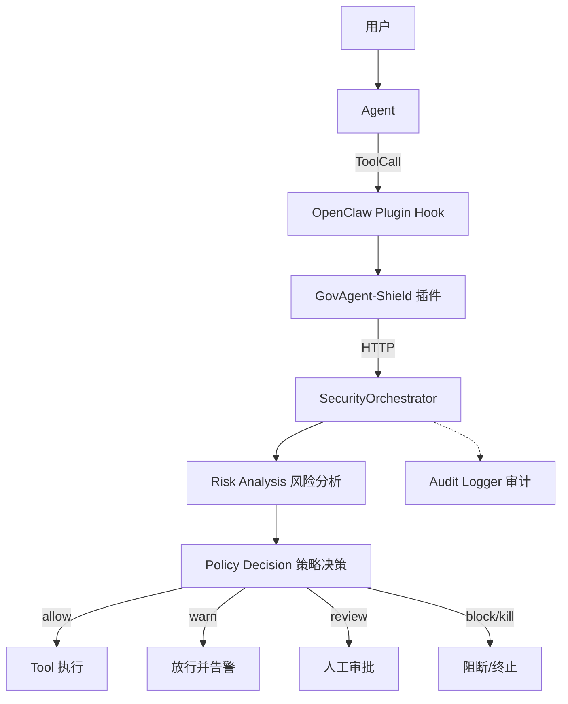

# GovAgent-Shield 项目技术路线方案

## 面向政企场景的大模型智能体安全关键技术研究

---

## 一、背景与问题

随着大语言模型从"对话工具"演进为具备自主规划、工具调用、数据访问与
操作执行能力的智能体（Agent），政企场景开始部署 Agent 完成文档处理、
信息查询、业务办理等任务。Agent 的能力边界在带来效率提升的同时，也
将传统安全风险迁移到了"运行阶段"：

- **敏感数据泄露**：Agent 在读取、汇总、外发环节可能触碰客户资料、
  居民信息、内部财务数据；
- **越权访问**：Agent 在缺乏身份与权限约束时，可能访问未授权资源；
- **Prompt Injection**：恶意用户输入或被污染的文档内容可覆盖系统指令，
  诱导 Agent 执行危险操作；
- **恶意工具调用**：Agent 可能调用上传、命令执行等高危工具；
- **不可追溯**：Agent 的工具调用、风险判定与处置过程缺乏统一审计，
  发生问题后难以回溯。

传统安全方案通常聚焦"数据边界"与"网络边界"：在输入侧过滤恶意内容、
在输出侧脱敏敏感字段。但 Agent 的真正风险发生在**工具执行瞬间**——
当 LLM 已经完成意图理解并生成 ToolCall，安全系统才第一次有机会介入。
传统方案无法覆盖 Agent 运行阶段的工具调用、行为链与执行控制，因此
需要一套面向 Agent Runtime 的安全防护体系。

---

## 二、总体技术路线

GovAgent-Shield 的总体技术路线可概括为五层架构：

```
Agent 接入层
    ↓
安全感知层
    ↓
风险分析层
    ↓
决策控制层
    ↓
审计追踪层
```

### 1. Agent 接入层

以 OpenClaw Plugin 为载体，通过 OpenClaw 原生 `before_tool_call` Hook
机制，在 Agent 生成的 ToolCall **真正执行之前**完成拦截。接入层不修改
Agent 主流程、不替换 Agent，保持对上层业务完全非侵入。

### 2. 安全感知层

对用户输入、文档内容与工具参数进行基础感知：检测 Prompt 注入、越狱与
指令覆盖；解析 ToolCall 的工具名与参数；采集会话上下文与行为历史，
为后续风险分析提供结构化输入。

### 3. 风险分析层

在感知基础上进行多维分析：

- **数据分类**：对工具调用涉及的数据进行公开/内部/敏感/核心分级；
- **权限检查**：基于 Agent 身份与策略进行访问控制判断；
- **行为分析**：识别单步异常与连续行为链；
- **诱饵检测**：通过诱饵资源发现 Agent 的异常探索行为；
- **风险评分**：融合多维风险信号生成综合风险分。

### 4. 决策控制层

由风险评分与策略引擎共同生成统一决策，并以 Decision Contract 作为
跨端协议，输出 `allow / warn / review / block / kill` 五种动作。Node
插件端只执行决策，不重复判断策略，保证策略语义单一来源。

### 5. 审计追踪层

记录 Agent 行为、工具调用、风险原因、策略来源与最终决策，形成可查询、
可导出的审计事件，支撑事后复盘与报告生成。

---

## 三、系统架构设计



系统由两端构成：

- **Python 安全引擎**：承担风险分析、策略判断与决策生成，是唯一决策中心；
- **OpenClaw 插件（Node/TS）**：承担 Hook 拦截、协议转换、决策执行与
  审计上报，保持轻量。

该架构将"策略判断"与"执行控制"分离，既保证安全逻辑集中可控，也便于
后续接入多种 Agent 框架。

---

## 四、核心技术方案

### 1. Agent Runtime 安全接入机制

采用 OpenClaw 官方 Plugin Hook 机制，在 `before_tool_call` 阶段获取
ToolCall 的完整上下文（工具名、参数、会话与 Agent 身份），并通过 HTTP
调用 Python 安全服务。多插件 Hook 由 OpenClaw 自动合并执行：任一插件
返回阻断即短路，其余插件与目标工具不再执行；安全服务不可用或返回未知
决策时默认阻断（fail-close），避免"服务故障即安全失效"。

### 2. ToolCall 安全分析机制

安全引擎对 ToolCall 进行结构化分析：

- **参数级检测**：识别路径穿越、敏感关键词、批量查询、外部目标等
  参数风险；
- **行为级检测**：维护会话内工具调用历史，识别"读取敏感数据后外发"、
  "连续敏感访问"等行为链；
- **数据级检测**：对涉及文件与数据对象进行分级，作为工具风险修正因子；
- **主动诱饵**：布置政企场景诱饵资源，Agent 触碰即产生高置信风险信号，
  无需依赖规则逐一枚举。

### 3. 多维风险评估模型

风险评估采用多维融合模型，综合输入风险、工具风险、输出风险、行为链
风险与诱饵风险五个维度。最终风险分由加权融合与最大维度兜底共同决定，
并映射为低/中/高/很高/严重等级。该模型保证单一信号不会主导结论，同时
高置信风险信号不会被平均化稀释。

### 4. 动态策略决策机制

决策层输出五种标准动作：`allow` 放行、`warn` 放行并告警、`review`
转入人工审批、`block` 阻断单次调用、`kill` 终止任务。动作语义通过
Decision Contract 在 Python 与 Node 端统一定义，避免跨端策略漂移；
权限策略支持单用户与企业双模式，可通过配置切换。

### 5. 安全审计机制

每次安全检查生成结构化审计事件，记录事件类型、策略来源、风险原因、
处置阶段与行为链摘要，持久化到本地 SQLite。审计字段与 Python/Node 端
协议对齐，支持按会话查询、汇总统计与管理后台展示。

---

## 五、创新点

### 1. 从传统数据安全扩展到 Agent 运行安全

系统将防护焦点从"输入/输出过滤"转移到 Agent 运行阶段，在 ToolCall
执行前完成检测与决策，覆盖传统方案无法触达的工具调用与行为链风险。

### 2. 非侵入式 Plugin Hook 架构

通过 OpenClaw 原生插件机制接入，不改 Agent 主流程、不改 LLM 调用，
以"旁路注入"方式实现安全增强，兼顾可用性与可落地性。

### 3. Tool 级动态安全控制

决策粒度精确到单次工具调用，支持参数级、行为级与数据级联合判断，
并可依据运行中风险动态调整执行结果。

### 4. 风险分析与执行控制闭环

"感知 → 分析 → 评分 → 决策 → 执行 → 审计"形成完整闭环，决策与执行
分离、策略单一来源、跨端协议统一，降低策略漂移与绕过风险。

### 5. 面向政企场景的数据保护能力

内置居民信息、客户资料、内部文件等政企数据分级与诱饵资源，贴合政务
办公业务语义，具备明确的场景价值。

---

## 六、工程实现情况

当前已实现并验证的核心工程内容：

- **Python 安全引擎**：实现输入检测、参数检测、行为分析、数据分级、
  诱饵检测、权限检查、风险评分与处置决策的完整调用链；
- **OpenClaw 插件**：实现 `before_tool_call` Hook、HTTP 安全调用、
  Decision Contract 与决策执行，并提供运行时测试；
- **FastAPI 服务**：提供工具调用检测与输出检测接口，支持真实
  OpenClaw 通过 HTTP 接入；
- **SQLite 审计数据库**：持久化安全事件，支持审计查询与汇总；
- **Streamlit 管理界面**：提供风险事件、权限、审批与监控展示；
- **测试体系**：包含 Python 单元/集成测试、插件单元测试、契约测试
  与红队攻击样本测试。

已实现的 Demo 场景覆盖敏感文件访问、敏感数据外发、Prompt Injection、
越权工具调用与行为链攻击，可直接用于现场演示。

> 说明：命令类工具的真实接入、模型增强检测与多 Agent 协同等能力尚在
> 规划阶段，本方案不将其列为已完成功能。

---

## 七、未来优化方向

### 1. 模型增强

在规则检测基础上引入轻量模型，提升模糊语义攻击与未知攻击模式的识别
能力，同时保持推理开销可控。

### 2. 规则自动生成

基于红队攻击样本与历史误报/漏报数据，自动生成与迭代检测规则，降低
人工维护成本。

### 3. 红队攻击测试

扩充攻击样本库，建立自动化红队评测流程，以攻击成功率（ASR）等指标
持续评估防护能力。

### 4. 多 Agent 协同安全

面向多 Agent 协同场景，建立跨会话、跨 Agent 的联合风险视图与统一
策略管理，防止单点绕过。

---

## 结语

GovAgent-Shield 以"Agent Runtime Security Layer"为定位，通过非侵入式
插件接入、多维风险分析与统一决策机制，构建了覆盖工具调用全过程的
安全防护与审计闭环。该技术路线兼顾创新性、工程可实现性与政企场景
落地价值，为后续持续增强提供了清晰路径。
