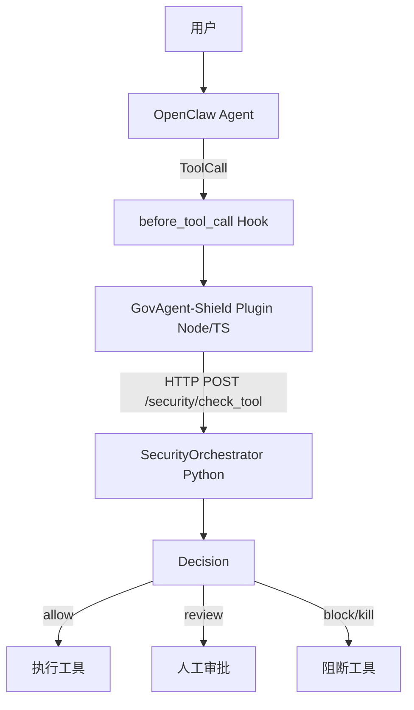

# GovAgent-Shield

面向政企场景的 **Agent Runtime Security Layer**。

GovAgent-Shield 不替换 Agent、不接管模型，而是通过 OpenClaw 的
`before_tool_call` Hook 在 **Tool 真正执行之前**完成安全检测，实现
Agent 行为感知、安全决策和审计追踪。

---

## 1. 项目简介

### 定位

> 面向政企场景的 Agent Runtime Security Layer

- 不替换 Agent，也不修改 Agent 主流程
- 通过 OpenClaw `before_tool_call` Hook 在 Tool 执行前介入
- 安全决策由独立 Python 引擎生成，Node 插件只负责拦截与执行控制
- 每一次 ToolCall 都会留下可审计的安全事件

### 解决的问题

- Prompt 注入与指令覆盖
- 越权工具调用
- 敏感数据读取与外发
- 工具参数风险（路径穿越、批量查询、外部目标）
- 连续异常行为链
- 诱饵资源触碰
- 审计溯源不足

---

## 2. Quick Start

### 环境要求

- Python >= 3.11
- Node.js（OpenClaw 运行时）
- OpenClaw（本地 `openclaw-main` 源码或发行版，自用版本为7.2）

### 第一步：启动 Python 安全服务

```powershell
python -m venv venv
venv\Scripts\pip install -r requirements.txt
venv\Scripts\python -m uvicorn src.main:app --port 8000
```

验证：

```powershell
Invoke-WebRequest http://127.0.0.1:8000/health
# {"status":"healthy"}
```

### 第二步：部署 OpenClaw 插件

将插件目录复制到 OpenClaw 扩展目录：

```powershell
Copy-Item -Recurse openclaw_plugin\govagent-shield D:\OpenClaw\openclaw-main\extensions\govagent-shield
```
（此处当换成本地部署openclaw的路径）

在 OpenClaw 配置（`openclaw.json`）中启用：

```jsonc
{
  "plugins": {
    "entries": {
      "govagent-shield": {
        "enabled": true
      }
    }
  }
}
```

### 第三步：验证接入

```powershell
cd D:\OpenClaw\openclaw-main
node openclaw.mjs plugins list --json
```

确认输出中包含 `govagent-shield` 且 `status: "loaded"`。

更详细的插件安装、配置与验证见
[openclaw_plugin/govagent-shield/README.md](openclaw_plugin/govagent-shield/README.md)。

---

## 3. Architecture



### 职责划分

Node 插件（`openclaw_plugin/govagent-shield`）负责：

- Hook 拦截：在 `before_tool_call` 捕获 ToolCall
- Tool 执行控制：根据决策放行或阻断
- 审计日志：记录检测结果与决策原因

Python 引擎（`src/security`）负责：

- 风险分析：输入、参数、行为链、数据分级、诱饵
- 策略判断：权限、工具风险
- 决策生成：通过 Decision Contract 输出统一 action

---

## 4. Security Pipeline

一次 ToolCall 的安全检测链路：

```
InputGuard → ParameterChecker → BehaviorAnalyzer → DataClassifier
→ DecoyManager → PermissionChecker → RiskScorer → DispositionEngine → AuditLogger
```

| 模块 | 职责 |
|---|---|
| InputGuard | Prompt 注入、越狱、指令覆盖、输入风险上下文 |
| ParameterChecker | 路径穿越、敏感词、批量查询、外部目标 |
| BehaviorAnalyzer | 单步行为与连续行为链 |
| DataClassifier | 数据分级：PUBLIC / INTERNAL / SENSITIVE / CRITICAL |
| DecoyManager | 诱饵资源触碰信号 |
| PermissionChecker | 权限策略（single_user / enterprise） |
| RiskScorer | 多维风险融合评分 |
| DispositionEngine | 最终决策：allow / warn / review / block / kill |
| AuditLogger | SQLite 审计事件记录 |

---

## 5. Demo Scenario

以下场景用于验证安全事件，而非普通业务流程。

### Demo 1：敏感文件访问

- 攻击行为：Agent 尝试读取含敏感关键词或诱饵路径的文件
- 触发 Tool：`read_document`
- 检测模块：ParameterChecker + DecoyManager
- 最终决策：`block`

### Demo 2：敏感数据外发

- 攻击行为：读取客户/员工数据后上传到外部地址
- 触发 Tool：`read_document` → `upload_data`
- 检测模块：DataClassifier + SensitiveDataLeakDetector + BehaviorAnalyzer
- 最终决策：`review` / `block` / `kill`

### Demo 3：Prompt Injection

- 攻击行为：用户输入或文档内容携带指令覆盖
- 触发 Tool：`read_document` / 任意输入
- 检测模块：InputGuard + InputRiskContext
- 最终决策：`block`

### Demo 4：越权工具调用

- 攻击行为：未授权 Agent 调用受限工具
- 触发 Tool：`upload_data` 等受限工具
- 检测模块：PermissionChecker（enterprise 模式 / 权限信号）
- 最终决策：`block`

### Demo 5：异常命令执行

- 攻击行为：Agent 尝试执行系统命令
- 触发 Tool：命令执行类工具（真实 OpenClaw `bash/exec` 接入）
- 检测模块：工具参数风险 + 行为链
- 最终决策：`block` / `kill`
- 说明：命令类工具的真实接入依赖 OpenClaw 工具名映射，当前属于规划中能力。

---

## 6. Testing

### Python 测试

```powershell
venv\Scripts\python -m pytest tests -q
```

### 插件测试

```powershell
cd D:\OpenClaw\openclaw-main
node_modules\.bin\vitest.cmd run extensions\govagent-shield
```

### 契约测试

`tests/contract/decision_contract.test.ts`：验证
Python 决策 → HTTP Client → Hook 的 allow / warn / review / block / kill 映射。

---

## 7. Repository Structure

```
GovAgent-Shield/
├── src/                  # Python：FastAPI、安全引擎、权限、审计、管理后台
├── openclaw_plugin/      # OpenClaw 插件（Node/TS）：Hook、HTTP、Decision Contract
├── openclaw_adapter/     # 早期实验适配层（DEPRECATED）
├── tests/                # Python 测试与契约测试
├── samples/              # 正常任务样本与攻击样本
└── scripts/              # 演示脚本
```

- `src/`：Python 安全服务，唯一决策中心
- `openclaw_plugin/`：真实 OpenClaw Runtime 接入层
- `tests/`：自动化测试
- `samples/`：红队样本与演示数据
- `scripts/`：可直接运行的演示脚本

---

## 8. Documentation

- [架构分析报告](Shield_Current_Architecture_Report.md)
- [最小增强设计](Shield_Enhancement_Design.md)
- [OpenClaw 插件 README](openclaw_plugin/govagent-shield/README.md)

---

## License

本项目用于揭榜挂帅比赛，仅限学习和研究用途。
