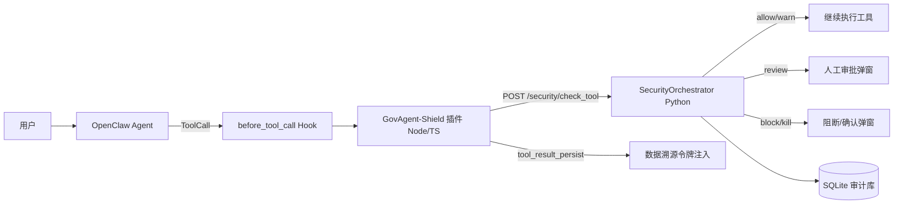

# GovAgent-Shield 系统 0.1.4 现状总结

> 面向队员的阶段性总结：系统定位、架构、风险链路、部署接入、
> 已实现功能与待办事项。

---

## 1. 一句话定位

GovAgent-Shield 是一个 **Agent 运行时安全层**：它不替换 Agent、
不改模型，而是在 OpenClaw 的 `before_tool_call` Hook 处拦截每一次
工具调用，由独立 Python 安全引擎做风险评分与决策，再决定
放行 / 告警 / 人工审批 / 阻断 / 熔断，并留下完整审计。

---

## 2. 系统架构



### 分层职责

| 层 | 组件 | 职责 |
|---|---|---|
| Agent 层 | OpenClaw Agent | 产生 ToolCall，不做安全判断 |
| 拦截层 | `openclaw_plugin/govagent-shield`（Node/TS） | 捕获 Hook、调用 Python 引擎、执行决策、渲染日志与审批弹窗 |
| 决策层 | Python `SecurityOrchestrator` | 唯一决策中心：输入/参数/行为/诱饵/权限/数据分级/溯源综合评分 |
| 审计层 | `SecurityLogger`（SQLite） | 记录事件类型、风险分、决策原因、策略 ID、调用链 |
| 辅助层 | SOC 管理后台（Streamlit） | Dashboard、任务监控、安全事件、权限管理、审批管理 |

---

## 3. 风险评定模型

### 3.1 五维风险

一次工具调用从 5 个维度评分，权重如下：

| 维度 | 含义 | 权重 |
|---|---|---|
| R_input | 用户输入 / 文档上下文注入风险 | 0.15 |
| R_tool | 工具参数风险（路径穿越、敏感词、外部目标、危险命令） | 0.25 |
| R_output | 输出敏感数据风险 | 0.15 |
| R_behavior | 行为链风险（高频读取、读取后外发、批量查询、危险组合） | 0.15 |
| R_decoy | 诱饵触碰风险 | 0.30 |

### 3.2 融合与分级

```text
FinalRisk = max(加权平均分, 最高维分 × 0.85)
```

| 级别 | 阈值 | 默认处置 |
|---|---|---|
| LOW | < 0.30 | allow |
| MEDIUM | 0.30 - 0.49 | warn |
| HIGH | 0.50 - 0.69 | review |
| VERY_HIGH | 0.70 - 0.84 | block |
| CRITICAL | >= 0.85 | kill |

### 3.3 数据分级

工具参数命中关键词或路径标记后分级：

| 级别 | 典型关键词 | 风险分 |
|---|---|---|
| CRITICAL | 绝密、top secret | 0.9 |
| SENSITIVE | 客户、公民、身份证、工资、薪酬、机密 | 0.7 |
| INTERNAL | 内部、预算、财务 | 0.4 |
| PUBLIC | 公开 | 0.0 |

### 3.4 资产身份识别

`AssetResolver` 从文件路径/参数文本匹配资产目录
（`data/asset_catalog.json`）：

| 资产类型 | 敏感度 | 示例关键词 |
|---|---|---|
| financial_document | HIGH | 财务预算、预算审批 |
| personnel_record | CRITICAL | 员工工资、人事信息 |
| customer_data | SENSITIVE | 客户名单、客户台账 |
| contract | HIGH | 合同、协议 |
| internal_document | MEDIUM | 内部、经营分析 |

---

## 4. 风险阻断链路

### 4.1 单次 ToolCall 检测链

```text
InputGuard → ParameterChecker → DataClassifier → AssetResolver
→ BehaviorAnalyzer → BehaviorObserver → DecoyManager
→ PermissionChecker → RiskScorer → DispositionEngine → AuditLogger
```

| 环节 | 检测内容 |
|---|---|
| InputGuard | 越狱、指令覆盖、提示注入、敏感外发指令 |
| ParameterChecker | 路径穿越、敏感文件名、批量查询、外部目标、exec 危险命令 |
| DataClassifier | 数据分级 |
| AssetResolver | 资产身份识别 |
| BehaviorAnalyzer | 30 秒高频读取、读取后外发、批量查询、危险工具组合 |
| BehaviorObserver | 虚拟诱饵规则，低权重风险信号 |
| DecoyManager | 静态诱饵文件/目录触碰 |
| PermissionChecker | 工具权限（single_user / enterprise） |
| DataProvenance | 数据溯源令牌外发扫描 |
| RiskScorer | 五维风险融合 |
| DispositionEngine | 最终决策 |
| AuditLogger | SQLite 审计 |

### 4.2 诱饵防御 Decoy ABC

1. **B 行为特征诱饵**：`BehaviorObserver` 对敏感资产访问输出
   `decoy_virtual_hit` 低权重信号，不直接阻断。
2. **A Shadow Decoy 路由**：高风险会话 + 敏感资产 + 读取类工具时，
   `DecoyManager.build_route` 生成重定向建议；启用时由
   `DecoyCopyGenerator` 创建会话级诱饵副本并预埋数据溯源令牌。
3. **C 数据溯源令牌**：`DataProvenanceTracker` 注册令牌；
   外发/写入类工具（含 `exec`）参数命中令牌即阻断并审计
   `data_provenance_leak_detected`。

### 4.3 决策执行（插件侧）

| 决策 | 插件行为 |
|---|---|
| allow | 放行 |
| warn | 放行，记录审计 |
| review | 审批弹窗（warning，允许一次 / 拒绝） |
| block | 确认弹窗（critical，仅确认） |
| kill | 确认弹窗（critical，仅确认）+ 终止任务 |

日志为中英双语右对齐格式；弹窗描述会写明具体操作
（读取文件 / 执行命令等）、原因与策略 ID。

---

## 5. 部署与 OpenClaw 接入

### 5.1 环境要求

- Python >= 3.11
- Node.js（OpenClaw 运行时）
- OpenClaw（本地 `openclaw-main`，当前自用版本 7.2）

### 5.2 启动 Python 安全服务

```powershell
cd E:\Openclaw项目\揭榜挂帅\揭榜挂帅项目主体\GovAgent-Shield
python -m venv venv
venv\Scripts\pip install -r requirements.txt
venv\Scripts\python -m uvicorn src.main:app --port 8000
```

验证：

```powershell
Invoke-WebRequest http://127.0.0.1:8000/health
# {"status":"healthy"}
```

### 5.3 部署 OpenClaw 插件

```powershell
Copy-Item -Recurse openclaw_plugin\govagent-shield D:\OpenClaw\openclaw-main\extensions\govagent-shield
```

在 `openclaw.json` 启用：

```jsonc
{
  "plugins": {
    "entries": {
      "govagent-shield": {
        "enabled": true,
        "options": {
          "endpoint": "http://127.0.0.1:8000",
          "timeoutMs": 5000,
          "failClosed": true
        }
      }
    }
  }
}
```

### 5.4 验证接入

```powershell
cd D:\OpenClaw\openclaw-main
node openclaw.mjs plugins list --json
```

输出中应包含 `govagent-shield` 且 `status: "loaded"`。

### 5.5 测试命令

```powershell
# Python 引擎测试
venv\Scripts\python -m pytest tests -q

# 插件测试（在 OpenClaw 目录）
cd D:\OpenClaw\openclaw-main
node_modules\.bin\vitest.cmd run extensions\govagent-shield

# 日志/弹窗本地预览（不启动 OpenClaw）
powershell scripts\preview_plugin_output.ps1
```

---

## 6. 已实现功能清单

### 6.1 安全检测

- [x] 输入检测：越狱、指令覆盖、提示注入、敏感外发指令
- [x] 工具参数检测：路径穿越、敏感文件名、批量查询、外部目标
- [x] exec 命令检测：删除/外发命令加分，命令内诱饵文件名可命中
- [x] 数据分级：PUBLIC / INTERNAL / SENSITIVE / CRITICAL
- [x] 资产身份识别：财务、人事、客户、合同、内部文档
- [x] 行为链分析：高频读取、读取后外发、批量查询、危险组合
- [x] 权限检查：single_user / enterprise 双模式
- [x] 输出敏感数据检测与脱敏（OutputGuard）

### 6.2 诱饵防御（Decoy ABC）

- [x] 静态诱饵：13 个诱饵文件 + 3 个诱饵目录
- [x] BehaviorObserver：虚拟诱饵低权重信号
- [x] DecoyManager：诱饵触碰检测（路径/文件名/命令内文件名）
- [x] Shadow Decoy 路由：高风险会话 + 敏感资产重定向建议
- [x] DecoyCopyGenerator：会话级诱饵副本 + DPT 令牌预埋
- [x] DataProvenanceTracker：令牌注册与外发/写入扫描（含 exec）

### 6.3 决策与执行

- [x] 统一 Decision Contract：allow / warn / review / block / kill
- [x] review：审批弹窗（允许一次 / 拒绝）
- [x] block/kill：deny-only 确认弹窗
- [x] kill：终止任务标记
- [x] 弹窗描述含具体操作、原因、策略 ID
- [x] fail-close：未知 action / 网络异常默认阻断

### 6.4 日志与审计

- [x] 中英双语右对齐日志块
- [x] SQLite 审计：事件类型、风险分、决策原因、策略 ID、防御阶段、调用链
- [x] 审计字段增强（Phase 2）

### 6.5 辅助层

- [x] SOC 管理后台（Streamlit）：Dashboard / 任务监控 / 安全事件 / 权限 / 审批
- [x] OpenClaw 插件预览脚本：不启动网关即可查看五种决策输出
- [x] 政务 Agent Demo 测试方案与 10 场景全流程脚本（`docs/`、`scripts/govagent_demo_test_flow.py`）

---

## 7. 待完成点

### 7.1 工具名对齐

引擎工具风险表使用 `read_document` / `upload_data` / `query_citizen_info`
等名称，而真实 OpenClaw 工具是 `read` / `exec` / `apply_patch` 等。
当前单用户模式下未登记 Agent 走 owner 全权限，所以不会被权限层误拦；
但若 Agent ID 正好是 `default_agent`（employee 角色），
`read` / `exec` 会被权限层直接阻断，需要补充工具名映射或调整权限配置。

### 7.2 输出脱敏接入插件

`OutputGuard` 与 `/security/check_output` 已实现，但插件
`after_tool_call` 目前只记录日志，未把工具输出送检做脱敏回写。

### 7.3 Shadow Decoy 真启用

`decoy_route` 默认 `dry_run=true`，只审计不实际改写参数；
需要把副本部署与令牌预埋真正启用，才能让 Agent 读到携带令牌的诱饵副本。

### 7.4 DPT 注入工具名

令牌注入目前只对 `read_document` / `query_citizen_info` 触发，
真实 OpenClaw `read` 工具名需纳入注入列表。

### 7.5 状态与配置

- 行为历史、令牌注册表为内存态，服务重启会清空
- 权限、资产、诱饵配置均为 JSON 文件，缺少管理界面写入入口
- enterprise 多角色模式未完整验证

### 7.6 OpenClaw 原生限制

- 弹窗“X 后过期”由 OpenClaw 原生 UI 渲染，插件无法删除
  （按约束不修改 OpenClaw 源码）
- 插件不修改 OpenClaw 内核，只通过扩展目录部署

---

## 8. 版本说明

- 本仓库 FastAPI 版本号：`0.1.0`
- OpenClaw 插件版本：`2026.8.0`
- 当前阶段总结口径：`0.1.4`（队员内部版本称呼）

---

## 9. 参考文档

- [OpenClaw 插件 README](../openclaw_plugin/govagent-shield/README.md)
- [政务 Agent Demo 测试方案](./政务Agent_Demo_测试方案.md)
- [架构分析报告](../Shield_Current_Architecture_Report.md)
- [最小增强设计](../Shield_Enhancement_Design.md)
